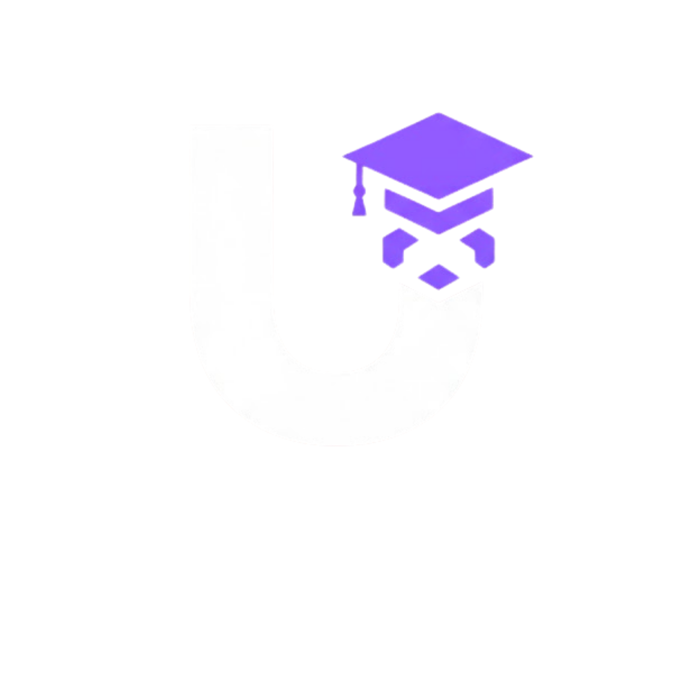

<div align="center">

<!-- Per aggiungere il logo: salva il tuo file immagine nella stessa cartella del README
     e sostituisci "logo.png" con il nome del tuo file -->


# UNIFINANCE

### *Where learning meets the market.*

[]()
[]()
[]()

</div>

---

## What is UniFinance?

**UniFinance** is a simulated stock market platform built for the classroom.

Students invest **imaginary money** in real stocks — Tesla, Apple, Amazon, and more — experiencing the thrill and risk of the market without any real financial consequences. Teachers monitor their students' portfolios, guide them through market dynamics, and rank their performance week by week.

It's financial literacy, gamified.

---

## Who is it for?

| 👨‍🎓 Students | 👩‍🏫 Teachers |
|---|---|
| Build and manage a virtual portfolio | Monitor every student's portfolio in real time |
| Track daily gains and losses | Evaluate students based on investment performance |
| Compete in weekly class rankings | Send tips and messages through the class chat |
| Analyze real stock market charts | Manage classes and student groups |
| Exchange messages with classmates | View both class and global leaderboards |

---

## Key Features

### 📈 Live Market Data
Stock prices update daily using real market data. Every decision your students make is based on what's actually happening in the world's financial markets.

### 💼 Virtual Wallet
Each student gets a virtual wallet loaded with imaginary capital. They can buy and sell stocks freely — no real money, real consequences.

### 🏆 Weekly Rankings
Every week, UniFinance calculates who performed best — both within each class and globally across the platform. The leaderboard resets weekly, keeping competition fresh.

### 🔔 Daily Alerts
Students receive daily notifications showing exactly how much they gained or lost on each stock. No surprises — just learning.

### 💬 Class Chat
Teachers and students stay connected through a built-in class chat. Teachers can drop tips, celebrate top performers, or flag risky moves.

### 🔐 Secure Login
Sign in with your **Google** or **Microsoft** account — or create a local account directly on the platform. No complicated setup required.

---

## How it works

```
1. Teacher creates a class and invites students
2. Each student receives a virtual wallet with starting capital
3. Students browse the market and invest in real stocks
4. Prices update daily — portfolios gain and lose value in real time
5. Every week, rankings are calculated and published
6. Teachers review performance and guide students toward better decisions
```

---

## Screenshots

> *(Screenshots coming soon — the interface is currently in final design phase)*

| Dashboard | Market | Rankings | Wallet |
|---|---|---|---|
| 📊 | 📉 | 🥇 | 💳 |

---

## Roadmap

- [x] Virtual wallet & portfolio management
- [x] Real-time stock market integration
- [x] Weekly class & global rankings
- [x] Daily profit/loss alerts
- [x] Class chat between students and teachers
- [ ] Mobile app version
- [ ] Advanced stock analytics & historical charts
- [ ] Custom starting capital per class (set by teacher)
- [ ] Achievement badges for students


<div align="center">

Made with 📚 and 📉 for the next generation of financially literate students.

</div>
